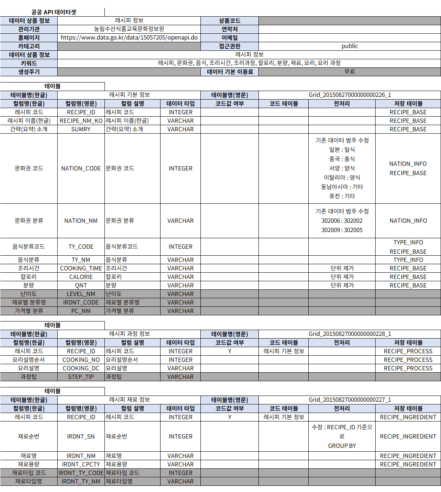
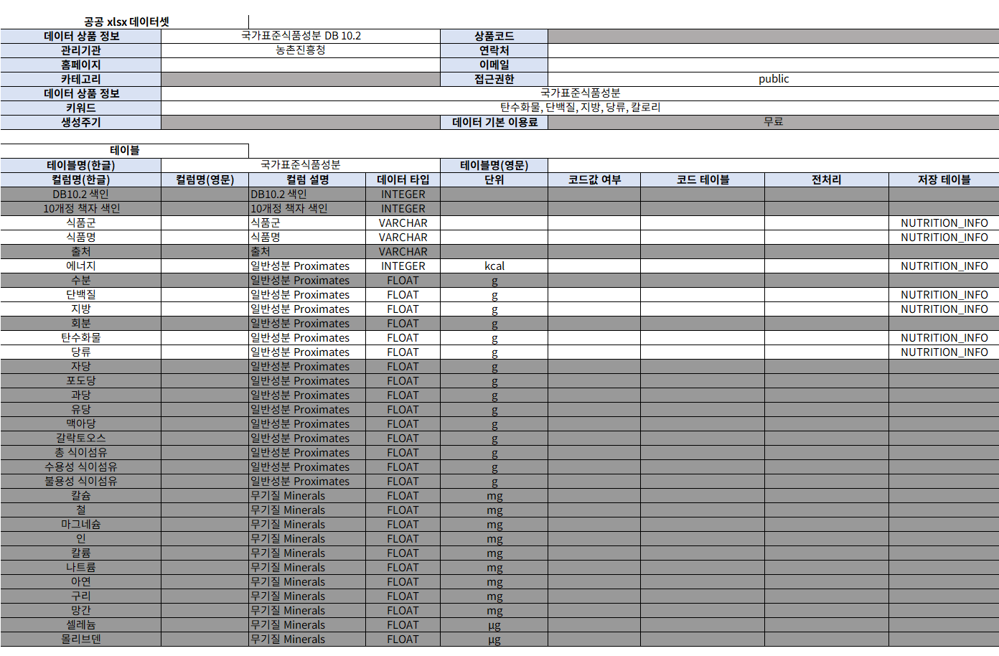
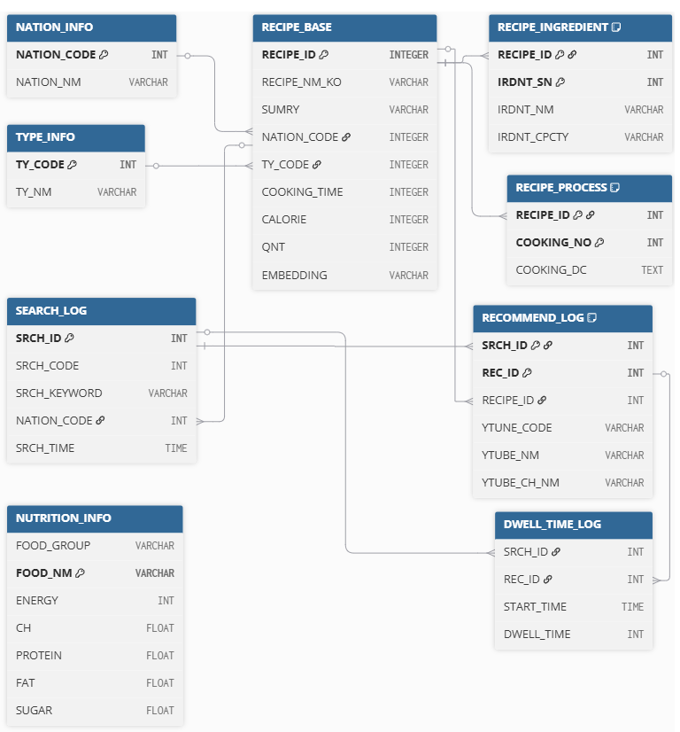
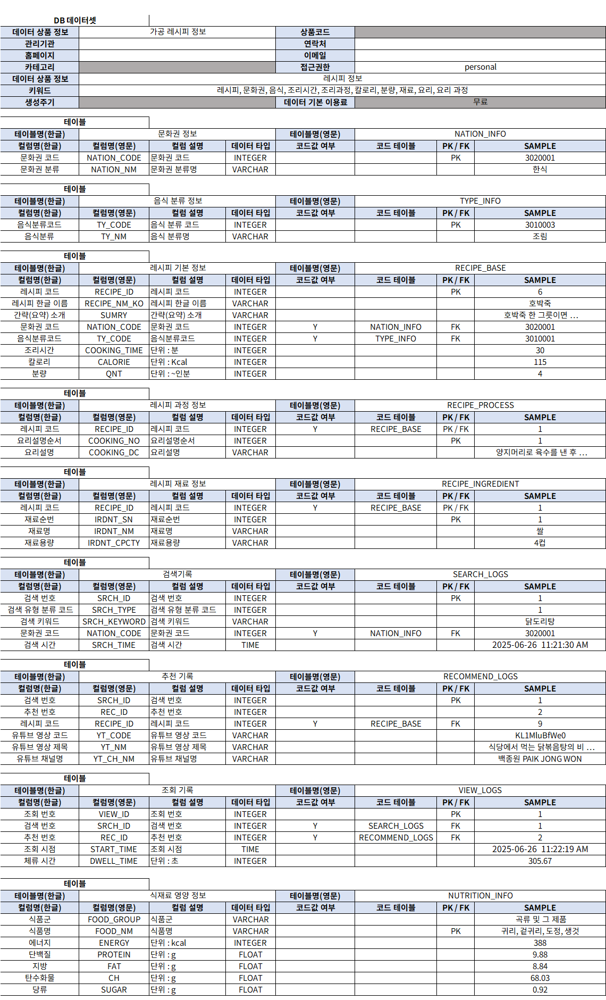
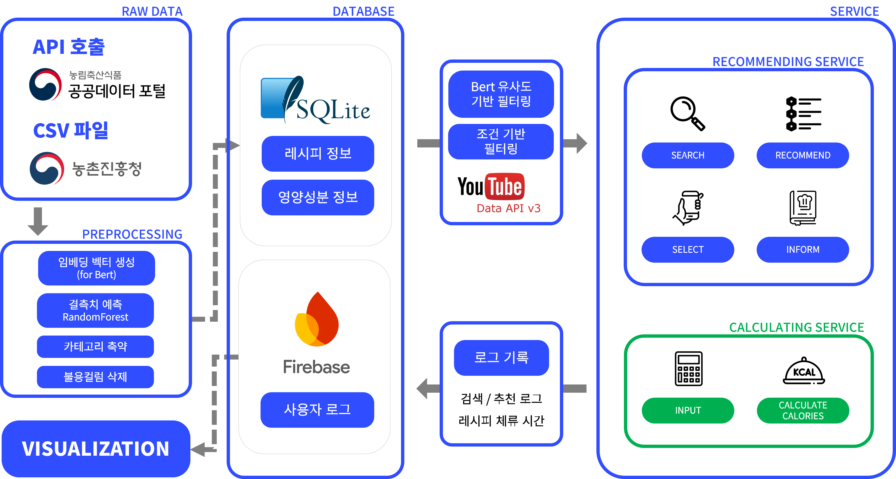
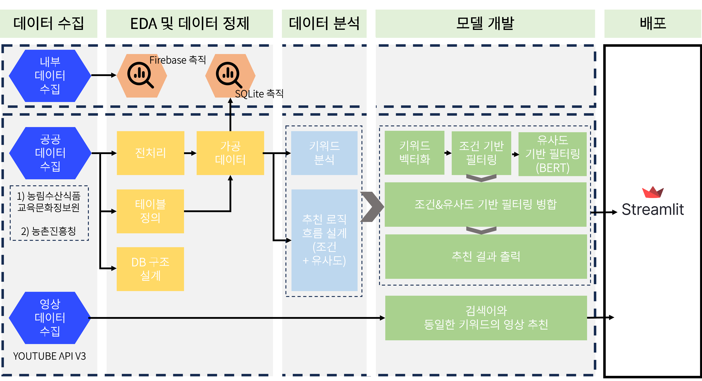
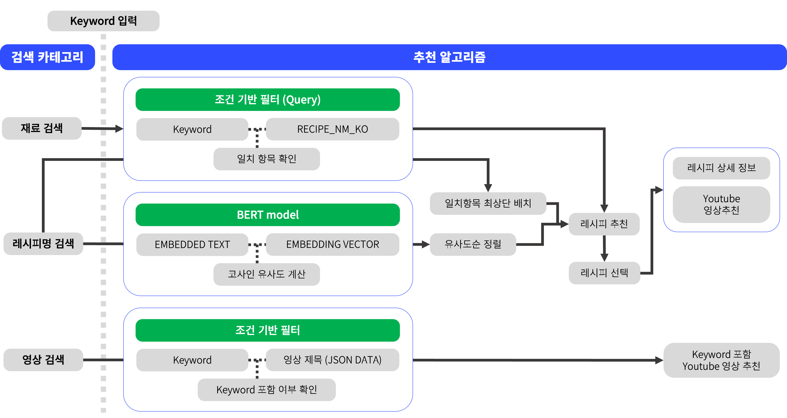
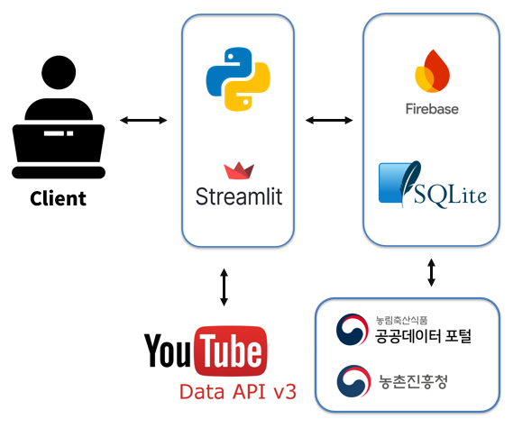
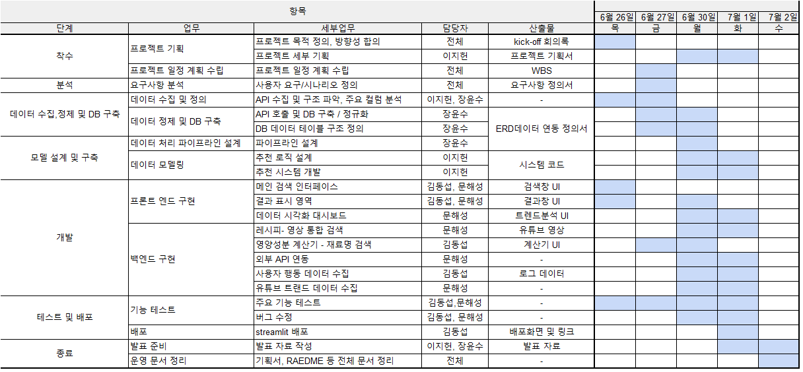

# 🍽️ 검색어 기반 레시피 추천 & 영양성분 계산 서비스

## LG U+ Why Not SW Camp 6기
### 📆 기간 : 2025.06.26 ~ 2025.07.02 
### 📌 팀명 : 컴백홈   
### 👨‍👧‍👧 팀원 소개

| 이름 | 역할 |
|------|------|
| 🥇 이지헌 | 데이터 분석, 팀장 |
| 🎖 장윤수 | 데이터 분석 |
| 🎖 김동섭 | 개발 |
| 🎖 문해성 | 개발 |
---

# 1️⃣ 프로젝트 개요

공공데이터와 유튜브 API를 활용하여 검색어 기반으로 레시피를 추천하고,  
관련영상 및 영양성분 계산기 기능을 제공하는 웹 서비스입니다.

---

# 2️⃣ 프로젝트 목적

- **📂 공공 데이터 활용**  
  대부분 국민들이 알지 못하는 레시피 관련 공공 데이터를 보다 실용적으로 제공

- **🎬 텍스트+영상 동시 제공**  
  영상과 텍스트 레시피를 함께 추천하여 사용자 선택지 및 경험 확장

- **🔍 의미 기반 검색**  
  단순 키워드가 아닌 유사도 및 정형화된 정보를 기반으로 하는 정밀 검색 서비스 구현

---

# 3️⃣ 주요 기능

### 1. 검색어 기반 레시피 추천
- 레시피명/재료명을 입력하면 조건 및 유사도 기반으로 레시피 추천
- 선택된 레시피에 대해 유튜브 영상 2개 자동 추천
- 유튜브 영상만 따로 검색도 가능 (5개 추천 + 더보기)

### 2. 영양성분 계산기
- **농촌진흥청의 국가표준식품성분 DB**
- 식재료명 + 용량 입력 시 칼로리, 탄수화물, 단백질, 지방, 당류 총합 제공

### 3. 트렌드 분석 대시보드
- 검색 수, 추천 수, 평균 체류 시간 기준 **Top 10** 레시피 시각화
- Firebase 로그 기반 **실시간 사용자 분석**

---

# 4️⃣ 사용 데이터 및 API

### 공공 API

**데이터 정의서**
  - 농림축산식품 공공데이터
  
  
  - 농촌진흥청 공공데이터
  

### 외부 API

---

# 5️⃣ DB 설계

- SQLite 기반 9개 테이블  
  - 주요 테이블 : `RECIPE_BASE`, `RECIPE_INGREDIENT`, `RECIPE_PROCESS`
  - 카테고리 : `NATION_INFO`, `TYPE_INFO`
  - 사용자 로그 테이블: `SEARCH_LOG`, `RECOMMEND_LOG`, `DWELL_TIME_LOG`
  - 영양정보 : `NUTRITION_INFO`
  
## ERD

  
  
## 테이블 정의서

  
---

# 6️⃣ 데이터 전처리

- 컬럼 정제, 타입 통일, 특수문자 제거 등
- `CALORIE` 값 0 → 랜덤포레스트 회귀모델을 통해 예측값으로 대체
- 재료명 정제 및 수치 계산 처리 등 고도화

## 데이터 플로우
  

## 서비스 플로우
  
---

# 7️⃣ 핵심 기술 및 모델

- Sentence-BERT 기반 벡터 유사도 추천 시스템
- 조건 기반 검색 + 유사도 기반 추천을 동시 적용
- 코사인 유사도 기반으로 의미 있는 레시피 탐색 제공

## 추천 알고리즘 플로우

---

# 8️⃣ 사용 기술

## Tech Stack

### 🖥 프론트엔드

### 🧠 추천 시스템

### 🔧 백엔드 / 데이터베이스

### 📊 시각화

### 🌐 외부 API

## System Architecture

---

# 9️⃣ 기대 효과

- 공공 데이터의 실질적 활용
- 레시피 튜터 기능: 텍스트 + 영상으로 조리 보조
- 영양성분 자동 예측 기능 확장성
- 공공기관 및 민간기업과의 협업 기대: 스마트 가전 연동 가능성 등

---

# 🔟 추진일정

**📅 기간: 2025년 6월 26일 ~ 2025년 7월 2일 (총 5일)**

